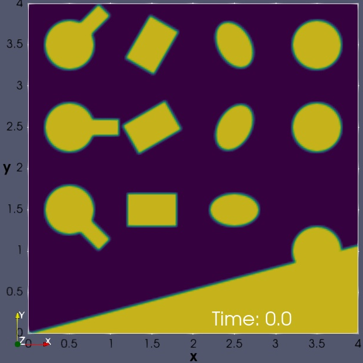

# sdfibm
An implementation of immersed boundary method in OpenFOAM v6 for simulating fluid-solid interaction and particle-laden multiphase flows. Licensed under [GPLv3](https://opensource.org/licenses/GPL-3.0).

-----------

# Installation
Requirement: `g++` with `C++11` support and OpenFOAM v6. Other compilers haven't been tested but mostly likely they work just fine.

## Step 1 OpenFOAM
Following the official [installation guide](https://www.openfoam.org), also please test afterwards by running some serial and parallel tutorial cases to ensure a working installation.

## Step 2 Compilation
Whether you are using your personal computer or using HPC, simply type the following three commands:
```bash
git clone https://github.com/ChenguangZhang/sdfibm.git
cd sdfibm/src
make
```
The solver binary is `./src/sdfibm`. You can soft-link it to your desire location as needed. For example, if the repo is cloned under home directory, then after compilation the command
```
sudo ln -s ~/sdfibm/src/sdfibm /usr/local/bin/sdfibm
```
will make the binary accessible system wide, and you can then type `sdfibm` to run a simulation without specifying the whole binary path every time.

## Important!

A 2D simulation in OpenFOAM really uses a one-cell thick 3D mesh, sdfibm requires the "thickness direction" to be $z$. In addition, the $z$-span of the mesh must be $[-0.5,0.5]$. In other words, the dynamics occurs exactly on the $z=0$, aka the $x$-$y$ plane. 


# Included examples
Cases under the [example](./examples) folder are some good starting points of using the code. That include

- 2D "flow past cylinder" at $Re=200$ (animation below)


- the Taylor-Couette flow with a rotational core. A MATLAB finite-difference script is also there, which solves a reduced-order PDE that validates sdfibm
- an ellipse that wobbles and settles in a rectangular container
- under `./examples\sedimentation` is a case where 100 circular particles settle in a square container. The particle trajectories plotted below clearly show the circulation caused by the counter flow. An animation is available at https://www.youtube.com/watch?v=C6U9X9zatz8.


Lastly, not directly related with immersed boundary method, a tool is created to smoothly initialize the phase field of VoF simulations. The word "smooth" here is essential when simulating low Capillary number flows. If the naive method that simply sets the phase fraction at mesh cells to 0/1 is used, a zigzag phase interface is created, which causes capillary waves that pollute the simulation easily. My tool initializes VoF phase field accurately and smoothly (image below is from the `./tool_vof/example` case).



# Code files

- `libshape` contains shape definitions using SDF
    - `ishape.h` the virtual base class all shapes inherit from. It also contains many SDF transformation and Boolean utilities
    - `shapefactory.h` implement the factory design pattern, it holds a library of shapes that are used in the `SolidCloud` class
    - `template.h` a heavily annotated template for creating new shapes, place to change are marked by `CHANGE`
    - `circle.h` a circle of radius $r$
    - `ellipse.h` an ellipse of radius $ra$ and $rb$
    - `kernel.h` legacy code for volume fraction calculation in square/cubic Cartesian mesh
- `libmotion` contains motion constraints. A rigid body has six degrees of freedom (linear velocity in $x$, $y$, $z$, and angular velocity in $x$, $y$, $z$), correspondingly many of the file names contains six digits of `[0,1,2]`. The convention is: 0 if the DOF is killed, 1 if it is free (i.e., unconstrained), and 2 if the DOF is prescribed.
    - `imotion.h` the virtual base class all motions inherit from.
    - `motion01mask.h` generic 0-1 mask of the degrees of freedom. It largely supersedes other files whose name contains 01 strings.
- `libcollision` for collision detection, currently only sphere-sphere and sphere-plane
- `solidcloud.h (.cpp)` the main class. It holds record of all solids and is responsible for reading the input, creating the shape/motion/material library, interacting with the fluid, and storing data into the `cloud.out` output file
- `solid.h` corresponds to the individual solid. It keeps and updates the kinematic and dynamic information of a solid. It also holds pointers to shape/motion/material instances obtained from the corresponding libraries in the `SolidCloud` class.
- `main.cpp` implements the projection method and the direct forcing IBM

# Output file
Information of the solid bodies is written to the `cloud.out` file, which has the simplest possible format: if there are $m$ solids and $n$ planes, each time step sdfibm writes $m+n$ lines, and each line contains 19 columns.

> names = ["t", "x", "y", "z", "vx", "vy", "vz", "fx", "fy", "fz", "EulerAx", "EulerAy", "EulerAz", "wx", "wy", "wz", "Tx", "Ty", "Tz"]

In words, they are:  
> Time, position-x, position-x, position-z, velocity-x, velocity-y, velocity-z, force-x, force-y, force-z, Euler_angle-x, Euler_angle-y, Euler_angle-z, angular_velocity-x, angular_velocity-y, angular_velocity-z, torque-x, torque-y, torque-z


# How to Cite
Please cite the following paper if you use this code.

Chenguang Zhang, Chunliang Wu, and Krishnaswamy Nandakumar. Effective geometric algorithms for immersed boundary method using signed distance field. Journal of Fluids Engineering, 141(6):061401, 2019.

# Misc.

I prefer 🍔 to coffee if you want to brighten my day :) [](https://www.paypal.com/cgi-bin/webscr?cmd=_donations&business=BWVSQXJKTRGSJ&currency_code=USD&source=url)